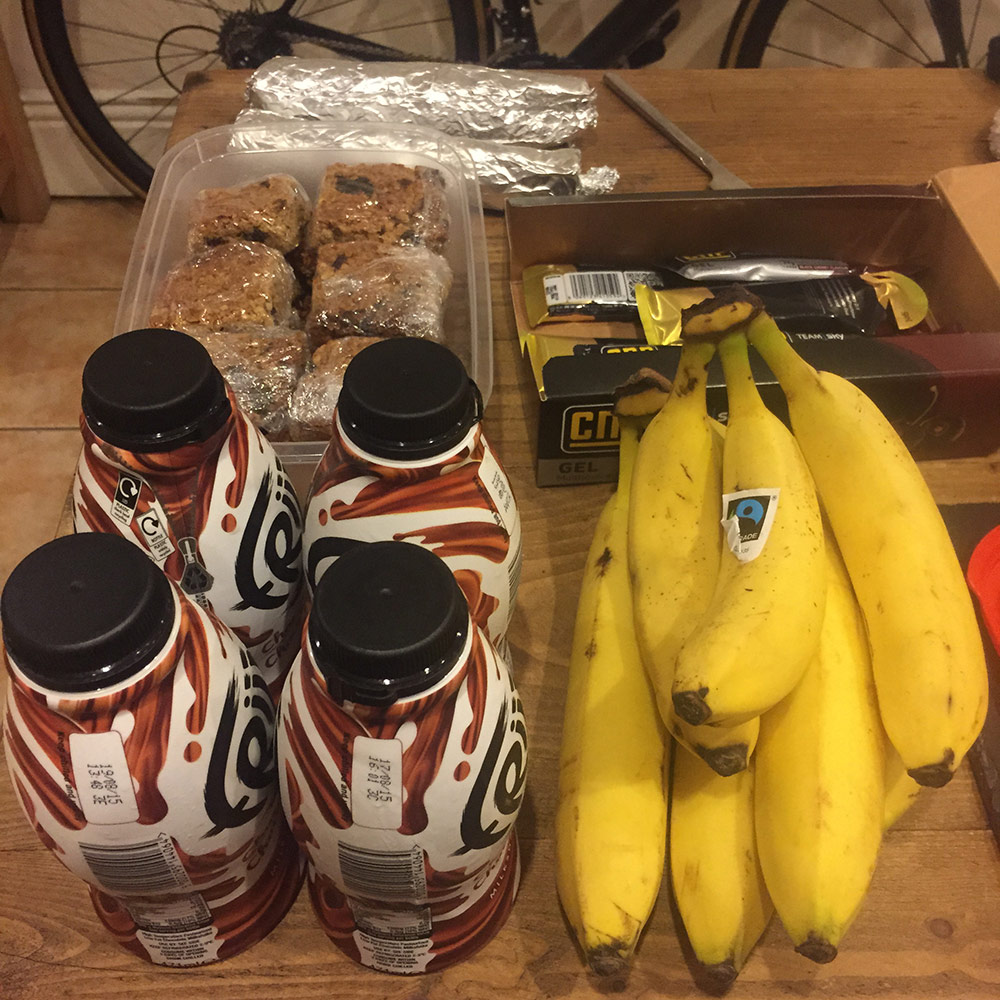
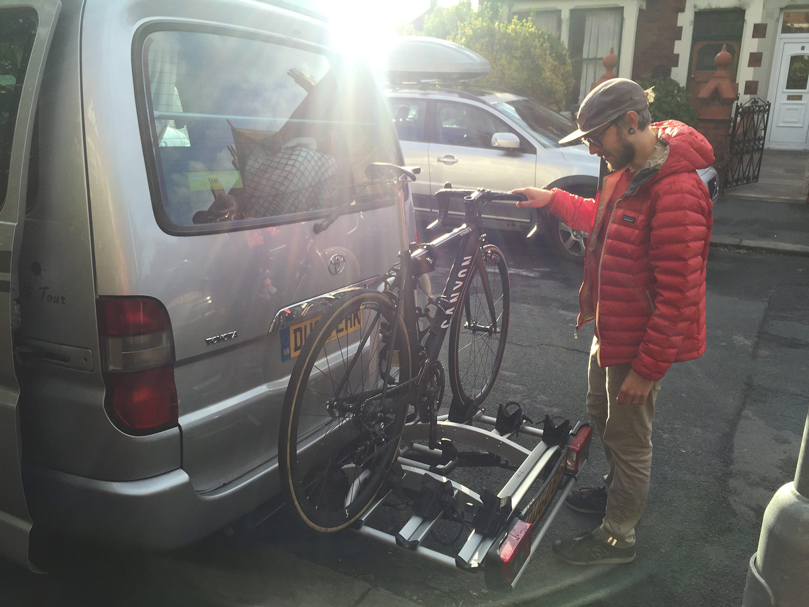
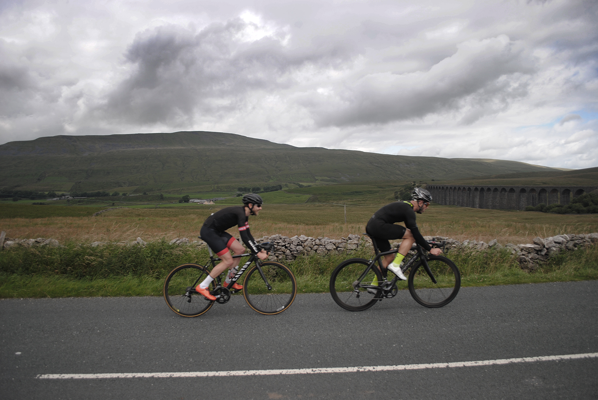
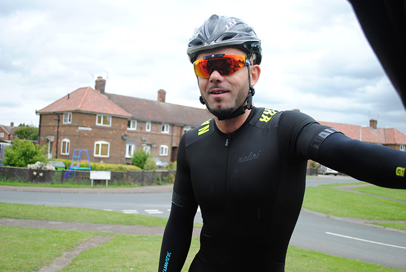
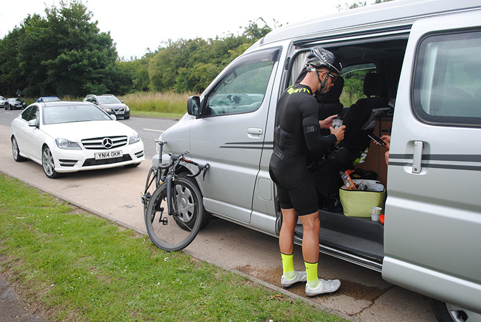
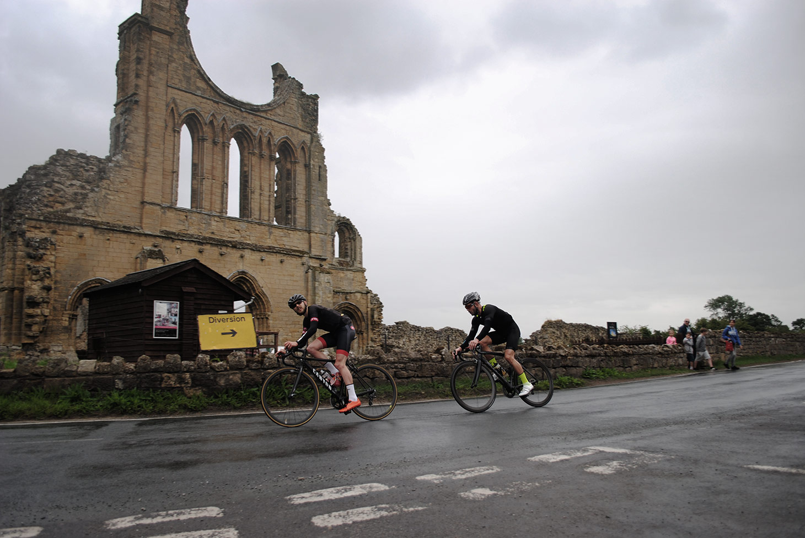

On a ride of this distance and intensity kit choice is important. The aim was to ride our route from Morecambe to Scarborough as quickly as possible. This meant equipment needed to be comfortable, as well as stiff, aero, and tight fitting.

Ross was on a Canyon Ultimate AL. His wheels were hand built from Fuse Cycling, and he used a SRAM Rival groupset. He wore a Castelli San Remo 3.0 SpeedSuit.

Phill chose to ride a Dedaccai Scuro rs. With Rolf Prima wheels and a Shimano Ultegra groupset. He wore a NALINI PRO Seano Race Bodysuit.

Both riders are huge fans of DeFeet socks. The comfortable Cyclismo was the choice for such a long day in the saddle. Honestly, you won't find better socks anywhere so don't even bother looking. Socks absolutely maketh the kit. And these are the best money can buy. No question.

> Fast socks = fast rides.

Although we aren't sponsored or endorsed by these companies in any way we'd still like to say a big thanks to them for making awesome stuff!

We used Strava to map our route and log our rides. We're both active members of our local community on the website and use it daily.

I'm sure everyone is familiar with Strava already but I find it helps keep cycling interesting. There's always a new challenge or segment to have a crack at. Or an epic ride you friends have done to motivate you.

For us though, It's not just fantastic way to socialise with other cyclists, it's actually how we met. So without Strava this ride would never have happened and I wouldn't have met one of my closest friends.

We'll ignore the fact that for the first few months of our friendship, I was cursing the name of Phill Sharpe for taking any and every KOM he fancied with ease. I didn't even believe he was a real person! Such is his strength on the bike.

> "The preparation and organising really added to the excitement."

<image-zoom></image-zoom>
<image-zoom></image-zoom>
<image-zoom></image-zoom>

<image-zoom></image-zoom>

A slight hiccup with the van the evening before we set off caused a mild panic.

We had been talking about this ride for months. Nothing was going to stop us from completing it!

> "I'll see you in Scarborough!"

<image-zoom></image-zoom>
<image-zoom></image-zoom>
<image-zoom></image-zoom>
<image-zoom></image-zoom>

<image-zoom></image-zoom>

<image-zoom></image-zoom>
<image-zoom></image-zoom>
<image-zoom></image-zoom>

<marker-link lat='54.039572' lng='-2.9073107' label='A' zoom='13'>Half Moon Bay Cafe</marker-link>, the start of our ride

> "We got a great start to Ingleton. 23mph showing at the start of the climb for the first hour. We were on course and ahead of what I imagined - happy!"

<image-zoom></image-zoom>
<image-zoom></image-zoom>

The video clip shows us climbing at speed past White Scar caves. We're near the top of the only major climb of the day and around 30 miles into the 133 mile route.

We're still feeling fresh and pushing on. We know that the first scheduled stop is at 40 miles. Right after a fast descent into Hawes.

> "This is the exact moment we hit 51mph"

<image-zoom></image-zoom>

<image-zoom></image-zoom>

<image-zoom></image-zoom>
<image-zoom></image-zoom>

<image-zoom></image-zoom>
<image-zoom></image-zoom>

<image-zoom></image-zoom>

<marker-link lat='54.1655977' lng='-2.4438979' label='B' zoom='13'>White Scar Caves</marker-link>

<image-zoom></image-zoom>
<image-zoom></image-zoom>

> "Onwards and upwards we pedalled. Through some of the most beautiful countryside England has to offer."

## After the highes of Hawes came the lows of Thirsk.

Everything was going better than planned.

We had reached our first food stop at 40 miles way ahead of schedule. After a quick peanut butter and jam wrap, a flapjack, and a chocolate milkshake we set off towards Thirsk. Our next and final rest at 80 miles.

The route from Hawes to Thirsk was some of the flattest terrain we would ride that day. We looked forward to some respite from the climbs and a gentle tailwind to push us along. We were confident we could stay above 23mph for the average speed.

However things went a bit pear shaped just after Layburn.

<image-zoom></image-zoom>

> We missed a turn off and the road looked poor anyway so decided best to detour and stay on a main road, but the prospect of us riding further didn't really appeal - the next hour was quite stressy for me, suffering anyway riding into the wind from Northallerton to Thirsk.

Our route turned off the main road and onto a dirt track which we couldn't risk riding. We decided to stay on the main road and join the route as soon as we could. This added an extra 5 miles and a lot of cross / headwind.

To make matters worse, we had become separated from the van during the route confusion. After a brief phone call the guys decided to make their way to Thirsk as planned where we would eventually meet them.

We weren't able to get onto the A1 (M) so our detour meant heading to Bedale and then Northallerton. We were low on food, and low on water at this point. In fact, everything was at all all-time low for the trip!

When we did eventually make it to Thirsk it was out of the frying pan and into the fire. It was race day. We had to battle our way through hordes of horse racing fans and traffic. It was sketchy at times, with buses and cars pulling out on us at every opportunity. Hungry and frustrated we eventually we made it to the van!

A low point of the day. The dashed line is the route we ended up taking, the solid line was the planned route.

> Would you two like a brew?

<image-zoom></image-zoom>

<image-zoom></image-zoom>
<image-zoom></image-zoom>

<marker-link lat='54.2339253' lng='-1.3654306' label='C' zoom='13'>Thirsk</marker-link>

> Then the rain came... Oh man, did it rain!

<image-zoom></image-zoom>
<image-zoom></image-zoom>

<image-zoom></image-zoom>

<image-zoom></image-zoom>
<image-zoom></image-zoom>

<image-zoom></image-zoom>

> The last 20-25 miles was an odd feeling.
Relief it was nearly done, but speed had dropped to 21.9mph. We had to push on through them last few villages.

<image-zoom></image-zoom>

<marker-link lat='54.2755481' lng='-0.4477915' label='D' zoom='13'>Scarborough</marker-link>

> Was crackers - couldn't see a thing, drinking a gallon of spray off each other's wheels, traffic... Carbon wheels and wet when it comes to slowing isn't ideal if you've never experienced it - you don't really stop any time soon!

<image-zoom></image-zoom>
<image-zoom></image-zoom>

We knew there is a final climb before descending into Scarborough itself and as much as I tried to get up as fast as I had left speed dropped to 21.9. My heart sunk!

We got to the top and I was "Ross just go!", and again like scalded cats in the torrential rain, no brakes down into the town centre - 22 came back to us. About a minute or so before we got the end and!

Shortly after we were met by the lads clapping and cheering! We had done it. Six hours, 3 minutes, 133 miles, 22mph dead.

So there we were in the middle of Scarborough. a place I really like. Fond memories from there already, and now another to add.

Shoppers walking around us, umbrellas up probably wondering what these two daft lads are doing with next to nowt on hugging each other and looking rather tired.

> Wonder where they come from?

<image-zoom></image-zoom>

> We came from the other side of the country!

Mostly the words of Phill Sharpe. Photographs and general awesomeness by Will and Dan.

Thanks guys. You're all absolute legends.
