*[Verified](https://fastestknowntime.com/route/lancaster-canal-uk) on the FKT website*

The first real Ultra distance test for my legs. And it went... OK! Before now, the longest run I have done is the [Hodder Way](/activities/hodder-way).

The day started at 5am. I ate a quick breakfast and packed up the car with gels and spare kit. At about 6, the boys and wife were bundled in too, and we made our way an hour north to meet Phill.

For this challenge, a good friend and excellent bike rider [Phill Sharpe](https://www.instagram.com/pedalinsquares/) followed me on his Mountain Bike with food and water. He's a saint. I think Phill had a tougher day than me. At times he was carrying up to 10x500ml bottles of water and 20 gels on his back! Considering the distance and heat, I'm so grateful for only needing to carry a bottle of water and my phone.

## Kendal (08:12)

We arrive at Kendal around 8am, where the "Lancaster Canal Trail" starts, rather uninspiringly, next to a recycling centre. A quick pic and kit check, and we are off. I start the clock at 08:12.

<image-zoom>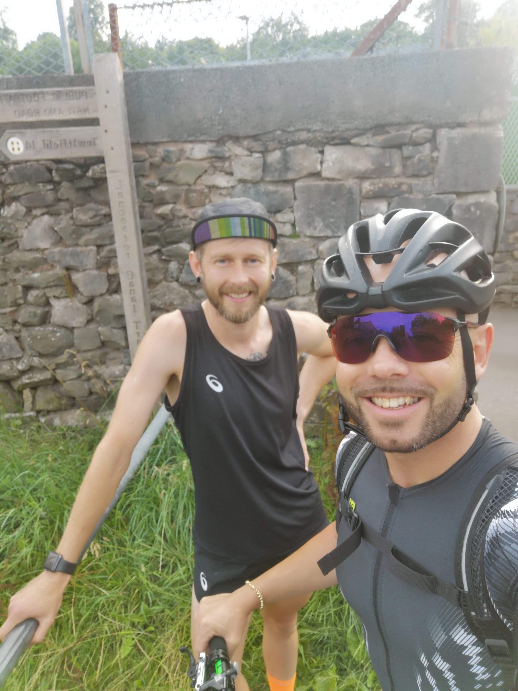</image-zoom>

The footpath is paved to allow a gentle warm-up as I ease myself into the unknown. All smiles, feeling great, out for a jog with my mate. The temptation is there to run at a quicker pace, but I manage to hold back as we chat and joke.

We're only a mile in before someone asks;

> "Going far lads?"

Yeah! To Preston actually!

Before long, the path snakes and winds into fields, woodland, and rooty single-track. It's excellent running terrain and a nightmare for someone on a bike. Stiles, fences and gates every few hundred metres mean Phill is getting some kind of high-intensity weight interval session as he chucks his bike over obstacles and sprints to catch me up.

<image-zoom>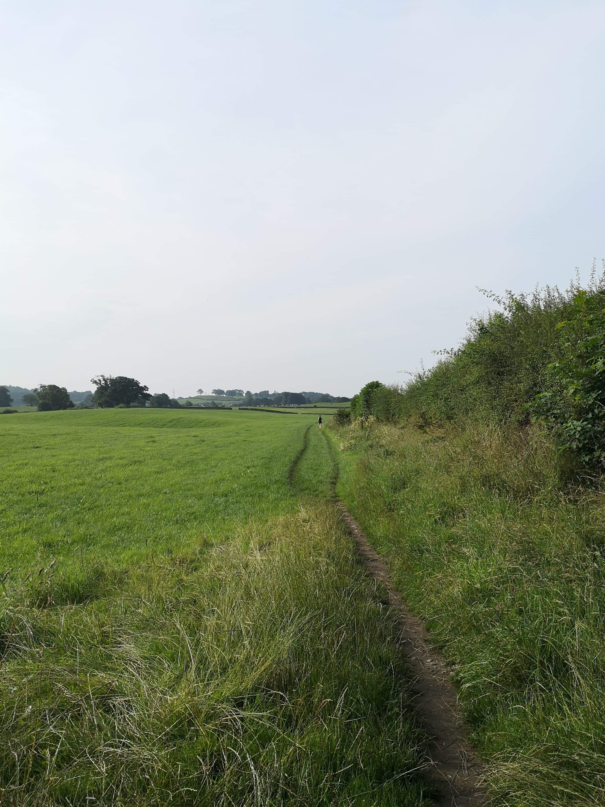</image-zoom>
<image-zoom>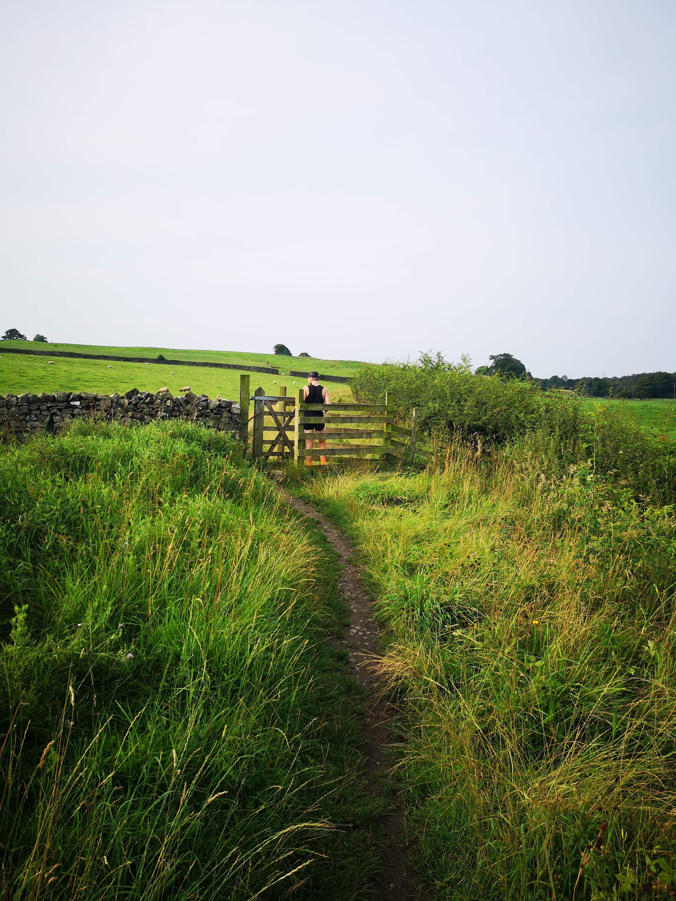</image-zoom>

<image-zoom>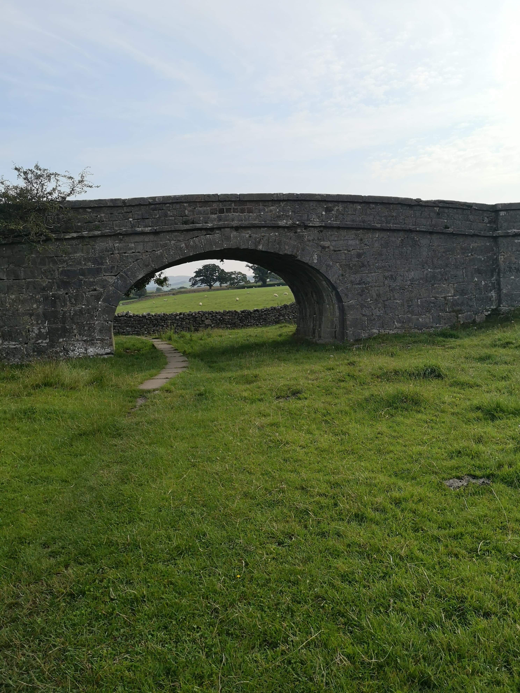</image-zoom>
<image-zoom>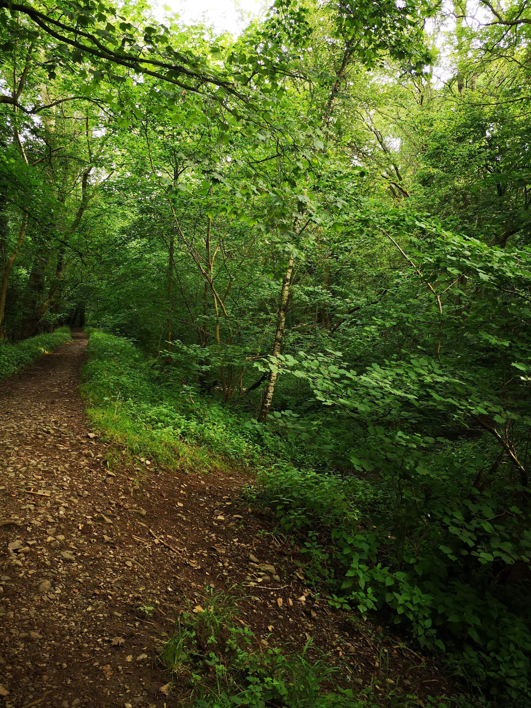</image-zoom>

It feels as though I'm gliding along effortlessly. The miles roll past as we follow the now-familiar Canal Trail signposts. Not that you'd get a boat up here mind.

6 miles in is the most surreal part of the day. We have arrived at Hincaster Tunnel. (I wish we had taken a video because you would not believe the path before us). Completely overgrown with things that sting, things that scratch, and things that are slippery and rooty it's an unexpectedly tricky section. Especially if, say, you're on a bike carrying a lead-weight backpack.

<image-zoom>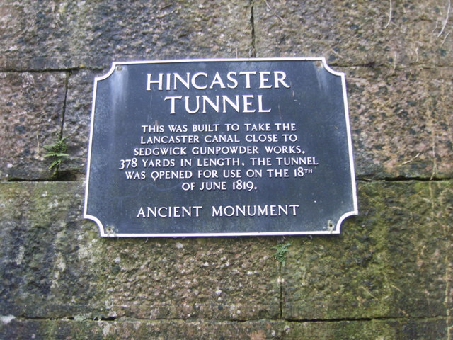</image-zoom>
<image-zoom>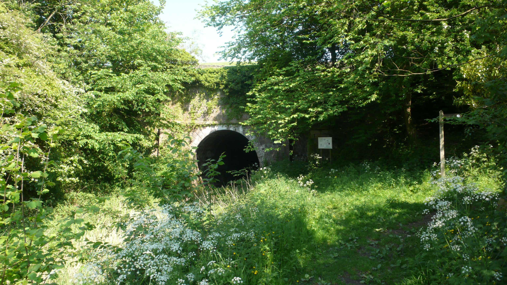</image-zoom>

<image-zoom>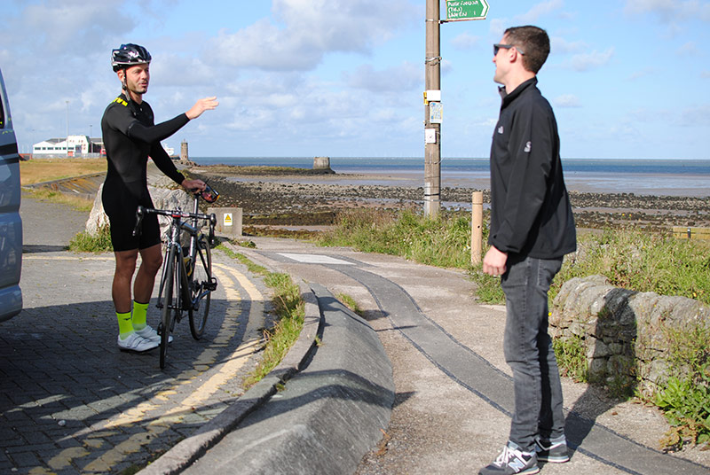</image-zoom>

I make it through unscathed, but Phill takes a tumble or two. The path emerges on the road at the other side of Hincaster Hill. I stop and sip some drink (I'm not drinking enough I think) while I wait for Phill to catch up. He'll have to push his bike through some parts, but he's taking a while. There was a switch-back on the descent with a gate. I hope he hasn't gone wrong...

> "There are two gates up there, and I wasn't sure which you'd gone through. I thought I'd just wait for you to come back, so I thought I'd go for a poo. I looked around and saw a path leading down between some thick trees and thought it looked like a decent way to get down... then realised oh shit! That *IS* the path!"

That's the most technically challenging part of the day done. We make steady progress towards the start of the actual canal at Stainton. The towpath here is closed for repair. A small diversion means running on the road for a few hundred metres.

<image-zoom>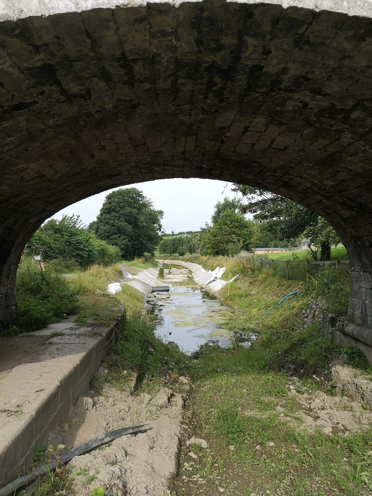</image-zoom>
<image-zoom>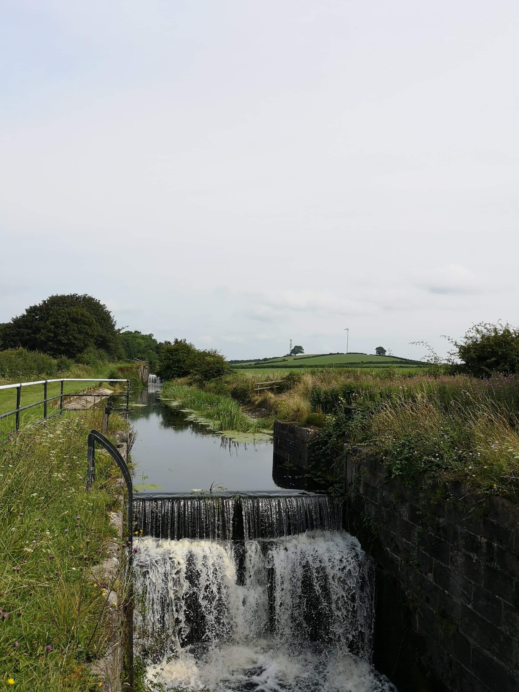</image-zoom>

Soon we're back where we should be. The canal to our left, endless towpath ahead. You' be forgiven for thinking this would be monotonous. And for sure, if you drop someone at random on the canal, then chances are they won't have a clue where the hell they are.

But it's just not what you expect.

There are so many characters end up here: Lads enjoying a few tins fishing; families on a day out; dog walkers; cyclists; joggers; folk who look like they've spent their life on a boat. All with a story playing out in front of you, one stride at a time. Yes, we're on the same path for hours a time, but we're (often literally) weaving in and out of so many lives.

<image-zoom>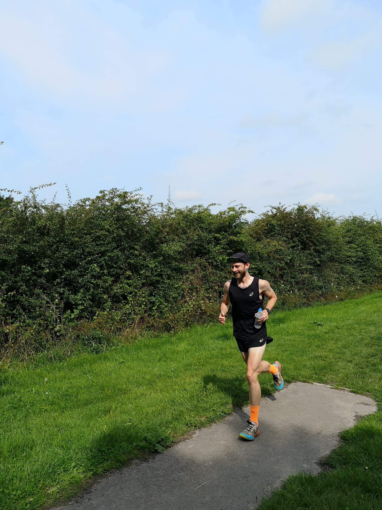</image-zoom>
<image-zoom>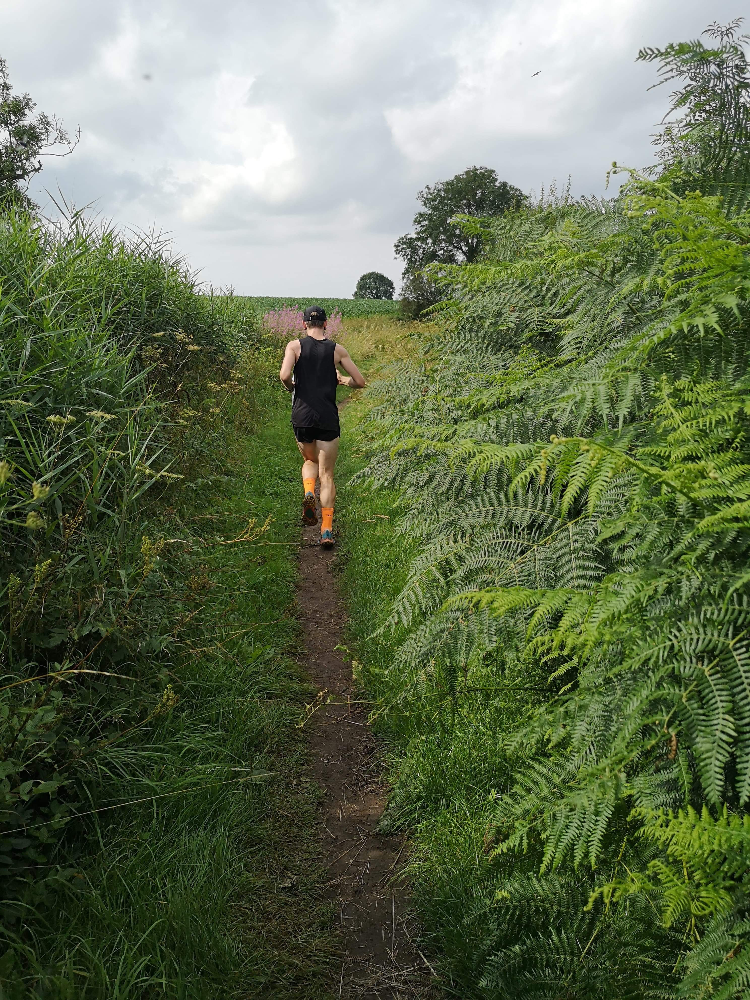</image-zoom>

24 miles in we're closing in on our only scheduled stop. I'm flying, feeling great considering. I need to hold back. Good friends Julie and Ian Sibbert are waiting for us with some fresh kit, food, and water. I said I would carry on at a walk as Phill stashed our goodies in his bag. Before we set off I said I wanted to try and not take on too much fluid or food at once, but the heat of the day (now 23c) got the better of me, and as I slowed properly for the first time I started to feel the effects of the high temperature. I guzzled a full bottle of water and devoured a ham wrap.

It 's nice to see Julie and Ian. I even manage a quick 5-minute chat as I walk along eating. But it's time to start jogging again. We're only about three miles from Lancaster now. Almost halfway!

I'm new to running, and it constantly surprises me. Because now I'm starting to feel the struggle. I don't know if it's mental, physical, or both.  I decide to back off to a fast walk for a while and see if it's just a case of digesting my wrap. I wonder what Phill is thinking. We're still a very long way from home!

<image-zoom>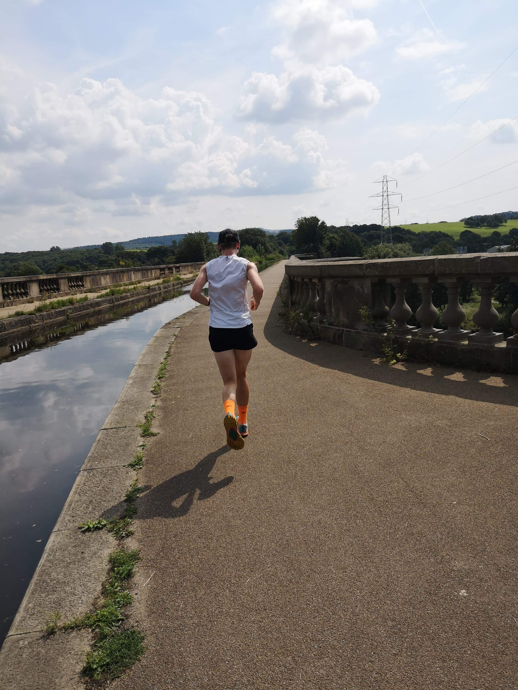</image-zoom>
<image-zoom>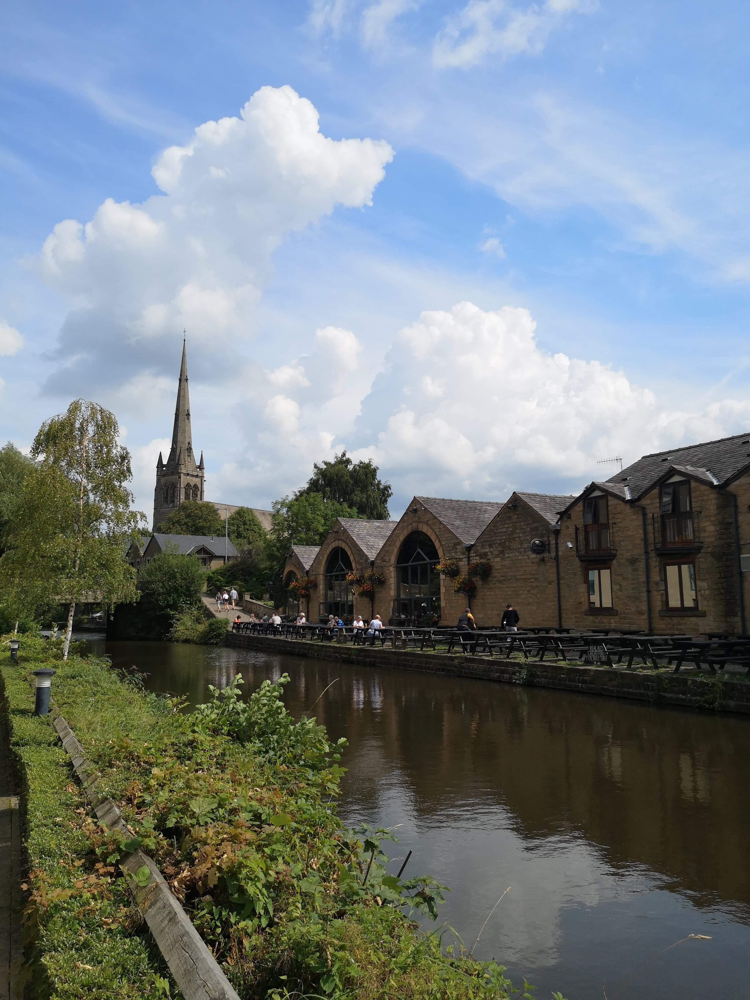</image-zoom>

<marker-link lat='54.048216645592504' lng='-2.794655274726267' label='A' zoom='15'>Lancaster</marker-link>

I'm running again as we pass through Lancaster, although my pace has noticeably slowed. My watch runs out of battery at Galgate, so I switch to my phone to record the rest. It's frustrating as I now have no idea how far I've gone or really where I am. The next 15 miles are a constant battle of wills: The head says go, but the legs say no.  I lose the fight at Garstang, and that's where I hit rock bottom. I walk for what feels like a long time but is only about ten minutes.

At some point across the canal Phill saw a buzzard. It was huge. We don't often see them like that so close. Usually, they are circling high in the sky, but I'm sure it saw me as easy pickings and came down to have a look!

I have done training runs on the canal south of Garstang, and so I know that there is a petrol station not too far away. I set myself the goal of running to it, no matter how slow or how bad my form is now. It's just over 3 miles and takes about half an hour. A small victory, and a bit of a boost to my morale.

Phill heads into the petrol station to grab some cold sugary drinks and painkillers for my back and quads. Both now rather sore! I decide to run with a bottle of Lucozade instead of water. It's not easy or pretty, but I manage to run for a good hour. I'm feeling much better, and for the first time, I'm sure I can finish.

The last two hours were rough, but we've made it to the home stretch. We're in Treales, a place I know well from cycling. I make a quick phone call to my father in law who is going to pick us up from Preston.

> "we're about an hour and 15/20 minutes away."

With that phone call made, the legs are back. It's 10k (well, just over at 6.3miles) to the finish. I put my head down and just run. I open up my stride a little for the first time in hours. It feels ... OK. The pain is still there, but I'm in control of it. I'm comfortably uncomfortable. Familiar territory for an endurance athlete. Maybe I even crack a smile.

<image-zoom></image-zoom>
<image-zoom>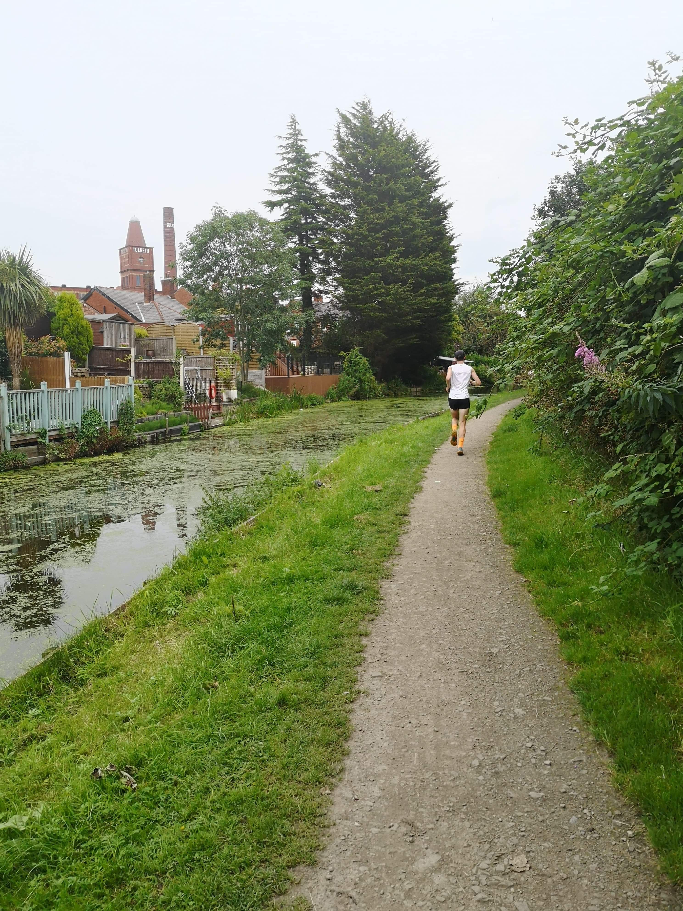</image-zoom>

<marker-link lat='54.04020160115954' lng='-2.490204776669657' label='A' zoom='15'>Coming in to Preston</marker-link>

In the closing two miles, we pass the aptly named "Final Whistle" cafe where I start to empty the tank completely. I have no idea how it actually looks, but I feel smooth and controlled.

Houses back on to the canal and there are all kinds of sights.

> "The boat moorings are quite eclectic. Some are like a chance to create a 'garden' of wild plants in pots others a chance to display a fashion show of badly dressed mannequins."

There's even one done up like a pub.

But this is it. I can see the end of the canal.

"I'm so fucking excited about not having to run anymore", I pant at Phill.

After almost ten hours, we're finally in Preston. I stop the clock at 9hrs 53mins. And just like that, we're slap-bang back in reality. The canal is a strange place, there's nothing quite like it. A minute ago we could've been anywhere in the country. You wouldn't know to look at it. Now we're stood in the heart of a council estate in Preston.
