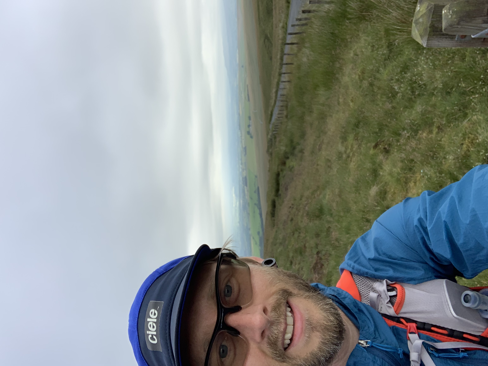

*[Verified](https://fastestknowntime.com/route/hodder-way-uk) on the FKT website*

I stumbled on this route while browsing the [Fastest Known Time](https://fastestknowntime.com) website a few weeks back. At only 28 miles it caught my eye as something that I could do with little preparation, and serve as excellent training for some of [the longer runs I have planned](/#schedule).

There is an [official website](http://hodderway.co.uk) with history, route description, and maps. Along with pages on the [LDWA website](https://www.ldwa.org.uk/ldp/members/show_path.php?path_name=Hodder+Way) and [Fastest Known Time](https://fastestknowntime.com).

The elevation profile trends downhill, which cunningly disguises the difficulty of the terrain. It's very overgrown and technical in places; There are sticky, boggy sections, and some of the black and white residents in the access land can be a bit grumpy.

I decided to go ahead with this run on a bit of a whim. And so was unsupported and running by myself the entire time. In fact, it's so quiet here compared to the Lake District I barely saw another person all day.

## The start (09:53am)

<image-zoom></image-zoom>
<image-zoom></image-zoom>

<marker-link lat='54.04020160115954' lng='-2.490204776669657' label='A' zoom='15'>The Source</marker-link>

At the top of Feltham Moor (Cross o' Greet), The start is easy enough to find and is the highest point of the day.

> Where the fence makes a slight bend left you should see, weather permitting, on your left some boggy ground with areas of longish grass interspersed with pools of standing water.

It's cool and fresh setting off up here. I'm wearing a jacket, which is a mistake. I always tell my wife when she goes out to "dress for the second mile", but today I neglected that advice. And so within a few minutes, I find myself running down a hill attempting to roll up and stuff a jacket into my pack.

The landscape and terrain for the first 10 miles are fantastic. My legs feel good, and I'm tapping away at a nice pace.

At the Cross of Greet Bridge, a narrow single-track flows parallel to the river. After a small section of access land where I somehow deviate wildly from the path, I find myself closing in on Gisburn forest. The best part of the route and a place I highly recommend visiting. Whether on foot on with a mountain bike.

<image-zoom></image-zoom>

I follow undulating trails through woodland, then alongside Stocks Reservoir. The views are mega and the sun is starting to shine.

<image-zoom></image-zoom>
<image-zoom></image-zoom>

<image-zoom></image-zoom>

<video src="./reservoir.mp4" controls></video>

Somewhere between Gisburn and Slaidburn, not I only do I miraculously have phone reception, I also happen to receive a phone call from our solicitors,

> Congratulations, we just wanted to tell you that you have now completed on your house purchase.

<image-zoom caption="This was a *long* time coming, and so a quick selfie to mark the occasion was required! I wonder how many people have bought a house during an FKT attempt?"></image-zoom>

<image-zoom></image-zoom>

Shortly after I'm passing through the lovely village of Slaidburn and into vast grassy fields where I run alongside the river for the first time in miles.

<video src="./river.mp4" controls></video>

I find thick grass drains the energy out of the legs a bit, but still, before long I reach Newton. Thinking to myself I'm now well on my way to the half way point, The Inn At Whitewell and allowing a few larger gulps of the water I've been rationing.

<image-zoom></image-zoom>

The way to Whitewell is mostly access land and fields with several river crossings over increasingly sketchy looking bridges.

<image-zoom></image-zoom>
<image-zoom></image-zoom>

<image-zoom></image-zoom>

I expect to hit Whitewell somewhere inside mile 14. Worryingly it's at 17 miles when I passed the place I got married - The Inn At Whitewell. Have I really managed to cover an extra 2/3 miles getting lost? It feels unlikely. I probably just remembered this information wrong when reviewing the route the day before.

I've done a lot of walking in this area and am pretty confident I know what to expect for the next section: *Boggy fields*.
(I'm not a huge fan). Yet, because of the dry spell we've enjoyed lately, most of the bogs are instead ankle-snapping craters. Of course this being Bowland there is still plenty of mud about (and there still will be on my feet for many days).

I shuffle up the climb out of Whitewell, one of the biggest of the course. By now my legs were fading thanks to pounding the downhills earlier. I live in a flat part of the world, so consistent downhill isn't something I'm used to. Making my way through seemingly endless fields filled with livestock and no clear path marked. For an area that holds so many happy memories, this is probably a low point of the day. It's slow going. I don't spend enough time with a map, so I'm pretty rusty at trying to quickly get my bearings at first. Thanks to today though, my map reading is a lot sharper again.

<image-zoom></image-zoom>

At 23 miles in I enter *another* field, one with cows. But the vibe is all off. The cows instantly group, stare me down, challenge me. I keep moving, trying to talk to them,

> "hey guys, it's all good, I'm just going to head over here, and I'll be out of your field and on my way."

They aren't interested.

They charge. I run. No, I sprint! Looking at the data afterwards I was doing low 5min/mi on tired legs during my hasty exit. I could've done without that surge of adrenaline. But I made it out unscathed.

<video src="./cows.mp4" controls></video>

Not many miles left at least, I think. I hope... It's supposed to be 27 total but I might have added on an extra 2 before Whitewell? 🤔. Just keep putting one foot in front of the other. I'll get there eventually.

Occasionally I find myself deep in overgrown woodland. Thick with nettles and brambles desperate to trip me up or snag my clothing. My legs take a real beating and are still tingling a day later from the stings and scrapes. That said, this battle is still more enjoyable than slogging across fields.

The map looking as dense as the foliage, I spend a lot of time retracing my steps, second-guessing my decisions. Making progress as slow as my navigation skills. I'm taking longer than anticipated on this technical section, losing time. It felt like I'm only either walking or standing still.

From mile 24 onwards, I can run again. It feels great to open my stride up and roll a steady pace. Remarkably, my legs, although tired still feel they can cope with the task at hand. I can finish this strong.

<video src="./trails.mp4" controls></video>

The final miles are some of the best. The undulating single-track path snakes next to the river. I'm in and out of woodland, crossing streams, and generally enjoying faster, more varied ground again.

There's a small road section followed by a final "F*ck You" from a field before the River Ribble comes into view and my adventure draws to a rapid conclusion.

I stop the clock at 5h 10m 48s. My water is as empty as my legs and only a scrap of Soreen left in a pack that was bulging with energy gels only a few hours ago.

<image-zoom caption="The River Hodder joining the River Ribble near Hurst Green."></image-zoom>

Now it's just a mile hike back to the road where a can of coke, a sit down, and my wife wait for me.
